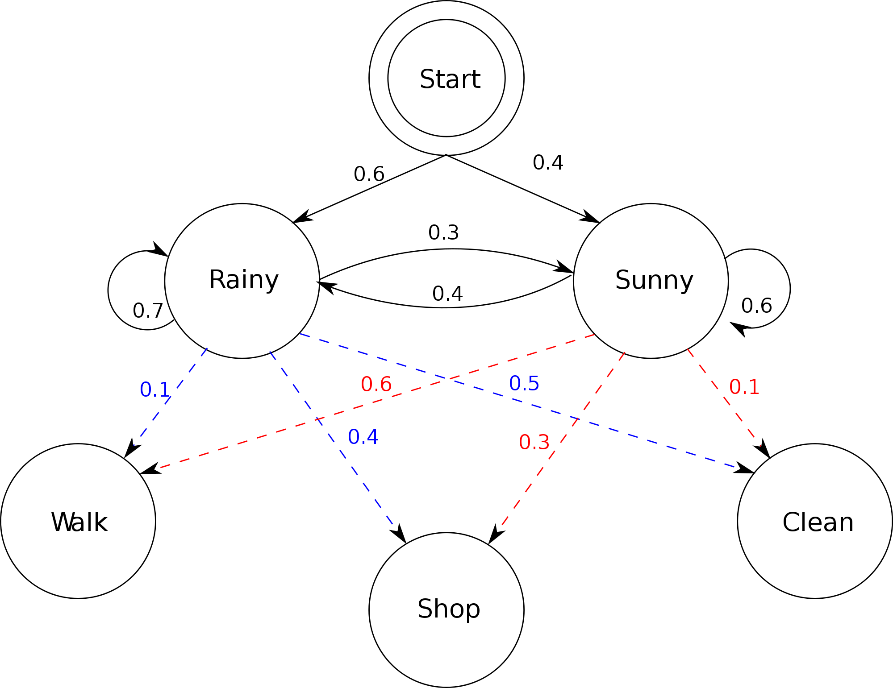
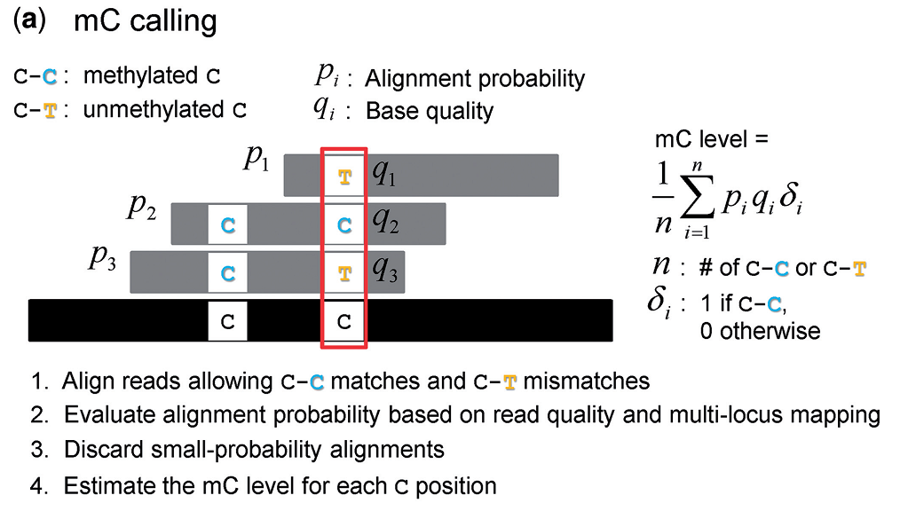
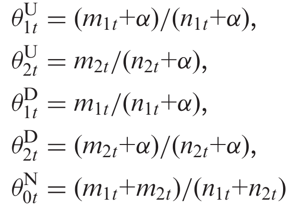
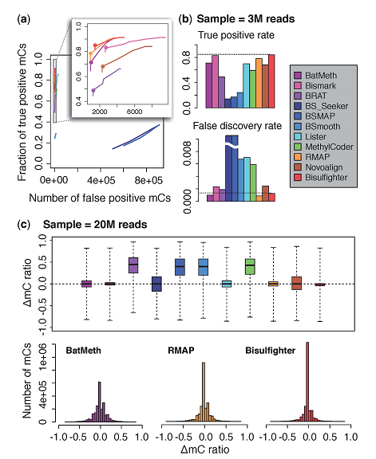

Bisulfighter: a hidden markov model approach to calling differentially methylated regions
========================================================
width: 1440
height: 900
transition: none
font-family: 'Helvetica'
css: my_style.css
author: 
date: March 10, 2014

<a rel="license" href="http://creativecommons.org/licenses/by-sa/3.0/deed.en_US"></a><br /><tiny>This work is licensed under a <a rel="license" href="http://creativecommons.org/licenses/by-sa/3.0/deed.en_US">Creative Commons Attribution-ShareAlike 3.0 Unported License</tiny></a>.

Markov Chains
========
- Series of states.
- Example: daily weather
- Probability of weather today is determined by weather yesterday.
- If current is known, probability of a particular progression of states can be found  eg: weather for the next few days: sunny-sunny-rainy-sunny-sunny


Markov Chains
=======
- Expectations for future days

```r
day0 = matrix(c(1, 0), nrow = 1, ncol = 2)
transition = matrix(c(0.9, 0.1, 0.5, 0.5), nrow = 2, ncol = 2, byrow = TRUE)
day1 = day0 %*% transition
day2 = day0 %*% transition %*%transition
```


```r
day0 # It is sunny today
```

```
     [,1] [,2]
[1,]    1    0
```

```r
transition # matrix of transition probabilities shown in graph
```

```
     [,1] [,2]
[1,]  0.9  0.1
[2,]  0.5  0.5
```

```r
day1 # 90% chance of sunniness tomorrow
```

```
     [,1] [,2]
[1,]  0.9  0.1
```

```r
day2 # 81% chance of sunniness two days from now
```

```
     [,1] [,2]
[1,] 0.86 0.14
```


Hidden Markov Models
==========

- assume modeled process is Markov process
- states are hidden
- observation probabilities are dependent on underlying states
- given current observation, probability of underlying state can be found using Bayes' Theorem
- given series of observations, probability of any sequence of underlying states can be found.



Hidden Markov Models
===========
- 3 types of problems:
  1. Given model parameters (transition and observation probabilities), what is the probability of seeing some sequence of observations
  2. Given some sequence of observations and model parameters, what is the "optimal" underlying sequence of states
  3. Given some sequence of observations, how can we optimize the model parameters to maximize the likelihood of the observations: P(observations sequence|model parameters)

- For detailed tutorial on how to implement solutions: google "rabiner hmm tutorial". click on any of the first three links

HMMs in Biology
=====
- Detection of genes: 
  - underlying states: exon, promoter, intergenic region, intron, etc.
  - sequence of observations: base sequence, eg. ATTACCAGATTCGCATTA

- Detection of evolutionarily conserved regions:
  - underlying states: conserved region, neutrally evolving region
  - sequence of observations: sequence of aligned bases eg. 

- Bisulfighter: detection of differentially methylated regions (DMR)
  - underlying states: up-DMR, down-DMR, "equally methylated region", "gap"
  - sequence of observations: comparative methylation levels of two samples at successive cytosines

Bisulfighter: mC calling
=====================




Bisulfighter: HMM structure
===============


    
----


Bisulfighter: HMM learning
======================

----


-----



Bisulfighter (using LAST): benchmarking simulated mCs
===================
- Take sequence of human chromosome X
- Insert polymorphisms (based on real allele frequencies)
- Define methylation level at each cytosine 
- Simulate 85 bp reads to read depths of 1M, 3M, 7M, 10M, 20M, 50M
  - take random 85 bp chunks out of sequence
  - number of chunks = read depth
  - cytosine is methylated with probability given by methylation level
  - convert unmethylated cytosine to thymine
- Assign a quality score to each base in each read

-------


Bisulfighter: benchmarking simulated DMRs
===============
- generate reads as before (sample 2)
- define regions as UP, DOWN and completely methylate/demethylate those regions
- generate reads as using these new methylation levels (sample 1)
- we can assume independence of methylation of adjacent cytosines by randomly changing methylation of 10% of cytosines


Bisulfighter: matching DMRs to real data
============
- Methlyation affects gene expression
  - whole genome bisulfite sequencing (WGBS) and RNA-seq on paired samples
  - compare overlaps between DMRs and transcription start sites
- Methylation affects chromatin structure
  - WGBS on paired samples with ENCODE DNase hypersensitivity data
  - compare overlaps between differentially sensitive sites and DMRs


Bisulfighter: conclusions
========
- Bisulfighter maps DMRs better than other methods
- Areas for improvement
  - methylation of non CpG cytosines
  - more sophisticated emission probability functions
  - more complex HMM architecture
  - incorporating biological replicates

mC calling for dataset1 &dataset2
========================================================


 ./bsf-call -c 0 --last=-d108,-e120 -o result/res.mc1 -W tmp.mc1 data/chrX.sub.fa data/1.fastq

 ./bsf-call -c 0 --last=-d108,-e120 -o result/res.mc1 -W tmp.mc1 data/chrX.sub.fa data/2.fastq


- d:  min. scoring threshold for gapless alignment 
- e: min. scoring threshold for gapped alignment 


========================================================


Prepare input fils for DMR detection
========================================================

mkdir tmp.dmr
../ComMet/util/Bsf2ComMetIn.pl result/res.mc1 result/res.mc2 > tmp.dmr/commet.in
\rm -f tmp.19092.1
\rm -f tmp.19092.2


detection between sample1 and sample2
========================================================

../ComMet/src/ComMet tmp.dmr/commet.in result/res.dmc result/res.dmr


========================================================


9 DMRs detected by ComMet 
========================================================


