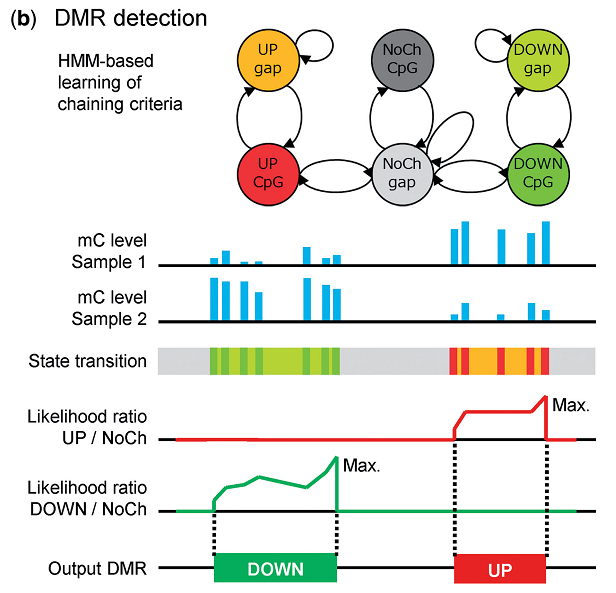

Bisulfighter: a hidden markov model approach to calling differentially methylated regions
========================================================
width: 1440
height: 900
transition: none
font-family: 'Helvetica'
css: my_style.css
author: Kenneth Chen
date: March 10, 2014

<a rel="license" href="http://creativecommons.org/licenses/by-sa/3.0/deed.en_US"></a><br /><tiny>This work is licensed under a <a rel="license" href="http://creativecommons.org/licenses/by-sa/3.0/deed.en_US">Creative Commons Attribution-ShareAlike 3.0 Unported License</tiny></a>.

Markov Chains
========
- Series of states.
- Example: daily weather
- Probability of weather today is determined by weather yesterday.
- If current is known, probability of a particular progression of states can be found  eg: weather for the next few days: sunny-sunny-cloudy-sunny-sunny


Markov Chains
=======
- Expectations for future days

```r
day0 = matrix(c(1, 0), nrow = 1, ncol = 2)
transition = matrix(c(0.9, 0.1, 0.5, 0.5), nrow = 2, ncol = 2, byrow = TRUE)
day1 = day0 %*% transition
day2 = day0 %*% transition %*%transition
```


```r
day0 # It is sunny today
```

```
     [,1] [,2]
[1,]    1    0
```

```r
transition # matrix of transition probabilities shown in graph
```

```
     [,1] [,2]
[1,]  0.9  0.1
[2,]  0.5  0.5
```

```r
day1 # 90% chance of sunniness tomorrow
```

```
     [,1] [,2]
[1,]  0.9  0.1
```

```r
day2 # 81% chance of sunniness two days from now
```

```
     [,1] [,2]
[1,] 0.86 0.14
```


Hidden Markov Models
==========

- assume modeled process is Markov process
- states are hidden
- observation probabilities are dependent on underlying states


Hidden Markov Models
===========
- 3 types of problems:
  1. Given some sequence of observations and model parameters (transition and observation probabilities), what is the probability of a certain underlying state sequence
  2. Given some sequence of observations and model parameters, what is the "optimal" underlying sequence of states
  3. Given some sequence of observations, how can we optimize the model parameters to maximize the likelihood of the observations: P(observations sequence|model parameters)
  
HMMs in Biology
=====
- Detection of genes: 
  - underlying states: exon, promoter, intergenic region, intron, etc.
  - sequence of observations: base sequence, eg. ATTACCAGATTCGCATTA

- Detection of evolutionarily conserved regions:
  - underlying states: conserved region, neutrally evolving region
  - sequence of observations: sequence of aligned bases eg. 

- Bisulfighter: detection of differentially methylated regions (DMR)
  - underlying states: up-DMR, down-DMR, "equally methylated region", "gap"
  - sequence of observations: base sequence including m ethylated cytosines

Bisulfighter: mC calling
=====================


Bisulfighter: HMM structure
===============



----


Oligonucleotide arrays
======================


------

- Fabricated by placing short cDNA sequences (oligonucleotides) on a small silicon chip by a photolithographic process
- Each gene is represented by a set of distinct probes, cDNA segments of length 25 nucleotides (11-20)
- Probes chosen based on uniqueness criteria and empirical rules
- Single color

Affymetrix arrays - probes
=================


-----------

- ~20 probes that “perfectly” represent the gene (Perfect Match)

- ~20 probes that do not match the gene sequence (Mismatch)

- Probeset

Affymetrix arrays - probes (suite)
=================


-------------------

For a valid gene expression measurement
the Perfect Match sticks and the Mistach does not!

Probe synthesis
===============

Let's watch a small video

http://www.youtube.com/watch?v=ui4BOtwJEXs


Affymetrix arrays
=================


Affymetrix protocol
=================


Affymetrix probesets
====================


Affymetrix image
====================


Illumina bead arrays
====================


<small>(Source: http://www.illumina.com/)</small>

-----


<small>(Source: http://www.mouseclinic.de/)</small>


Illumina bead arrays - image
===================


-------

- Illumina bead arrays can be applied to different problems
- Can use one or two colors depending on the application
- Gene expression arrays use one color

Illumina bead arrays
====================

- High density arrays
    - HumanHT-12 v4.0 Expression BeadChip, about 47,000 probes
- A specific oligonucleotide sequence is assigned to each bead type, which is replicated about 30 times on an array
- Bead level data can be relavitely large


Summary of technologies
=======================

cDNA microarray | Affymetrix | Illumina
 ---|---|---
1 probe/gene | 1-20 probes/gene | 30 beads(probes)/gene
Probe of variable lengths | 25-mer probes | 50-mer probes
Two colors | One color | One color
Flexible, choice of probes | High density/Replication | High density/Replication
- | Cross hybridization | -


Analysis pipeline
==================

1. Biological question
2. Experimental design
3. Experiment
4. Image analysis
5. Normalization, Batch effect removal
6. Estimation, Testing, Clustering, Prediction, Classification, Feature selection, etc.
7. Validate finding generate new hypothesis $\rightarrow$ New experiments

**Most of these steps require the use of statistical methods and/or computational tools**

**Note:** Even though microarrays were designed to study gene expression, they can be used to study many other things (DNA-protein binding, methylation, splicing, etc). Though they are slowly being replaced by sequencing-based assays.
